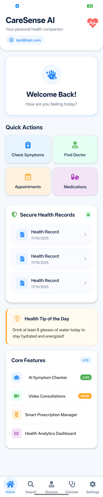
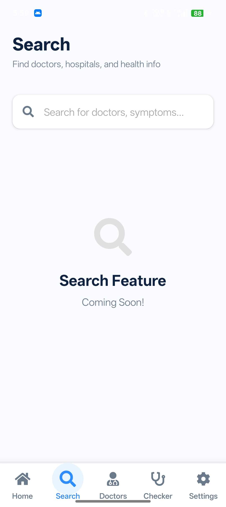
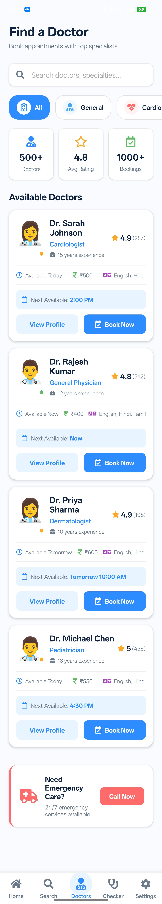
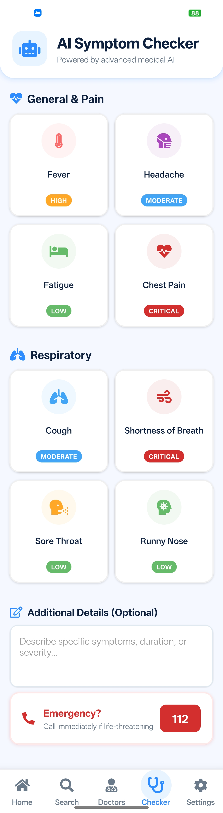
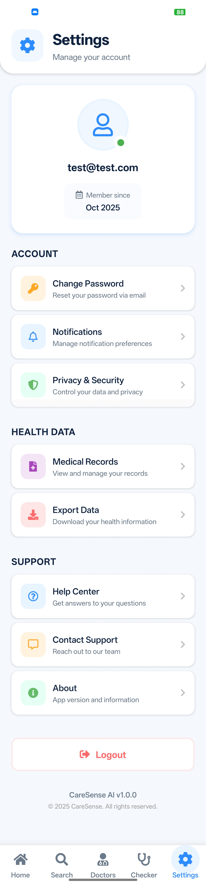

# CareSense AI – Frontend

CareSense AI is an intelligent health-tech platform that leverages AI to analyze user-reported symptoms, provide potential condition insights, recommend medications, and connect users with relevant doctors for faster and more accessible healthcare.

## 🚀 Features
- Symptom input and analysis interface
- AI-based condition prediction display
- Medicine recommendation system (UI)
- Doctor suggestion interface
- Clean and user-friendly mobile UI

## 🛠 Tech Stack
- React Native (Expo)
- JavaScript
- Firebase (For Login/Sign-up)

## 🧠 Architecture
- Component-based structure using React Native
- Context API for state management (Auth, Popup handling)
- Modular folder structure (screens, components, hooks)
- Designed for scalable backend API integration

## 📱 Project Status
Currently in development (MVP stage)

## 🔐 Backend
Backend is private for security purposes.

## 🚀 Features
- AI-powered symptom analysis interface
- Condition prediction with severity classification (Low, Moderate, Critical)
- Medicine recommendation system (UI)
- Doctor discovery with ratings, availability, and booking interface
- Emergency assistance integration (112 quick access)
- Clean, modern, and responsive mobile UI

## 📸 Screenshots

### 🏠 Home Screen

### 🔍 Search

### 👨‍⚕️ Doctors

### 🤖 AI Symptom Checker

### ⚙️ Settings

## 🎯 Vision
CareSense AI aims to bridge the gap between users and accessible healthcare by leveraging AI to provide instant, intelligent, and affordable health guidance.

## 👨‍💻 Developer
Suraj Das
