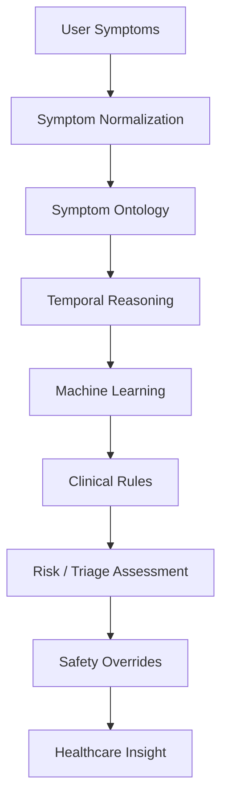
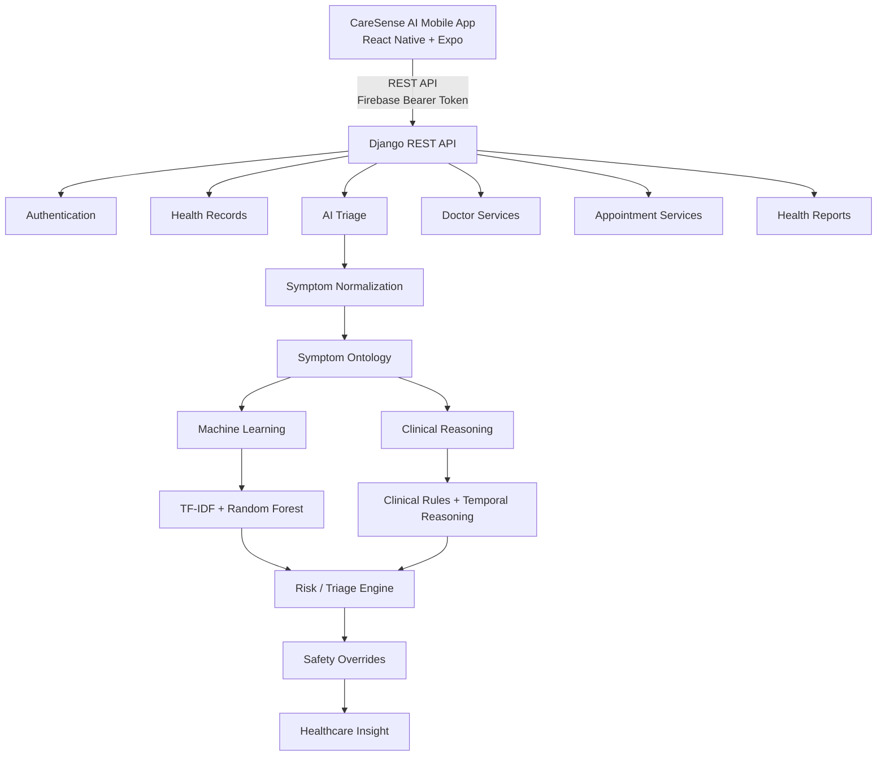

# CareSense AI

<p align="center">
  <strong>AI-Powered Healthcare Decision Support Platform</strong>
</p>

<p align="center">
  Understand symptoms. Assess urgency. Make informed healthcare decisions.
</p>

<p align="center">
  
  
  
  
</p>

---

## Overview

**CareSense AI** is an AI-powered mobile healthcare decision-support platform designed to help people understand their symptoms, assess potential urgency, manage health information, and access healthcare-related services through a simple and accessible mobile experience.

Users can describe their symptoms in natural language instead of navigating complicated medical forms. The application sends authenticated requests to the CareSense AI backend, where symptoms are processed through a multi-layer analysis pipeline combining **symptom normalization, machine learning, clinical reasoning, temporal analysis, risk classification, and safety rules**.

The resulting healthcare insight is presented through a clear and easy-to-understand mobile interface.

CareSense AI is designed with a **safety-first architecture** and does not rely entirely on a single generative AI service.

> **Medical Safety Notice:** CareSense AI is a healthcare decision-support system. It is not a diagnostic system and does not replace qualified healthcare professionals, clinical examinations, laboratory investigations, or emergency medical services.

---

# ✨ Features

## 🩺 AI Symptom Checker

Users can describe their symptoms naturally using everyday language.

The application supports information such as:

- Symptoms
- Symptom combinations
- Severity
- Duration
- Associated symptoms
- Relevant health information

The information is sent to the backend for structured analysis.

The returned insight may include:

- Possible health conditions
- Risk level
- Triage level
- Symptom summary
- Recommended actions
- When to seek medical attention
- Relevant medical specialties

---

## 🧠 Hybrid AI & Clinical Reasoning

CareSense AI uses a layered reasoning architecture instead of depending entirely on a single AI model.

### Analysis Pipeline


```mermaid
flowchart TD
    A[User Symptoms] --> B[Symptom Normalization]
    B --> C[Symptom Ontology]
    C --> D[Temporal Reasoning]
    D --> E[Machine Learning]
    E --> F[Clinical Rules]
    F --> G[Risk / Triage Assessment]
    G --> H[Safety Overrides]
    H --> I[Healthcare Insight]
```

### Intelligence Layers

The backend analysis system combines:

- Natural-language symptom processing
- Symptom normalization
- Symptom ontology
- TF-IDF feature extraction
- Random Forest classification
- Clinical pattern detection
- Weighted symptom scoring
- Positive clinical rules
- Negative clinical rules
- Duration-based reasoning
- Temporal reasoning
- Risk classification
- Deterministic safety overrides

This layered architecture is designed to provide more predictable behavior and reduce dependency on external generative AI services.

---

# 🚦 Risk & Triage Assessment

CareSense AI evaluates reported symptoms and assigns an appropriate level of urgency.

Depending on the information provided, the system may guide the user toward:

- Self-care and monitoring
- Routine medical consultation
- Prompt medical attention
- Emergency evaluation

High-risk symptom combinations can trigger deterministic safety rules that take priority over ordinary model predictions.

The application is designed to communicate urgency clearly without presenting an AI prediction as a confirmed medical diagnosis.

---

# 📋 Health Records

CareSense AI allows authenticated users to maintain a history of their health assessments.

Health records may contain:

- Reported symptoms
- Normalized symptoms
- Symptom summaries
- Triage information
- AI-generated insights
- Recommendations
- Relevant healthcare information
- Assessment timestamps

Users can:

- View their records
- Open individual records
- Review previous assessments
- Delete their own records
- Access generated health reports

Health records are scoped to the authenticated user.

---

# 📄 Health Reports

CareSense AI supports generating health assessment reports from stored health records.

Report access is protected through authenticated backend requests rather than exposing authentication tokens through URLs.

This helps prevent unauthorized access to protected health information.

---

# 👨‍⚕️ Doctor Discovery

The application includes doctor discovery functionality that allows users to browse available healthcare providers.

The doctor experience is designed to make it easier for users to move from symptom assessment toward professional healthcare consultation when appropriate.

---

# 📅 Appointments

CareSense AI includes appointment-related functionality for:

- Viewing appointments
- Finding doctors
- Booking appointments
- Accessing appointment information

The frontend provides the user interface while appointment processing is handled by backend services.

---

# 💊 Medication Information

The application includes medication-related functionality for presenting healthcare information and recommendations.

Medication-related features are designed around a safety-first approach.

CareSense AI does not intend to replace professional prescribing decisions, and medication information should not be treated as a substitute for medical advice.

---

# 🔐 Authentication & Security

Security is a core part of the CareSense AI architecture.

The mobile application uses **Firebase Authentication** for user authentication.

Authenticated requests are sent to the backend using Firebase ID tokens.

```text
Mobile Application
       │
       │ Firebase ID Token
       ▼
Django REST API
       │
       │ Token Verification
       ▼
Authenticated User
       │
       ▼
Protected Resource
```

The backend verifies the Firebase token before processing protected requests.

### Security principles

- Firebase Authentication
- Verified Bearer tokens
- Backend token verification
- User-specific health records
- Backend ownership validation
- Protected API endpoints
- Authenticated PDF report access
- No authentication tokens in URL parameters
- Sensitive files excluded from source control
- Client-provided user IDs are not trusted for record ownership

The authenticated Firebase UID is used by the backend to determine record ownership.

---

# 🏗️ System Architecture

CareSense AI is divided into separate frontend and backend applications.


```mermaid
flowchart TB
    A[CareSense AI Mobile App<br/>React Native + Expo]

    A -->|REST API<br/>Firebase Bearer Token| B[Django REST API]

    B --> C[Authentication]
    B --> D[Health Records]
    B --> E[AI Triage]
    B --> F[Doctor Services]
    B --> G[Appointment Services]
    B --> H[Health Reports]

    E --> I[Symptom Normalization]
    I --> J[Symptom Ontology]
    J --> K[Machine Learning]
    J --> L[Clinical Reasoning]

    K --> M[TF-IDF + Random Forest]
    L --> N[Clinical Rules + Temporal Reasoning]

    M --> O[Risk / Triage Engine]
    N --> O

    O --> P[Safety Overrides]
    P --> Q[Healthcare Insight]
```

---

# 📱 Frontend Architecture

The mobile application is responsible for the user-facing experience.

```text
User
 │
 ▼
Authentication
 │
 ▼
Home
 │
 ├── Symptom Checker
 │       │
 │       └── AI Healthcare Insight
 │
 ├── Health Records
 │       │
 │       └── Record Details
 │
 ├── Doctor Discovery
 │       │
 │       └── Appointments
 │
 ├── Medications
 │
 └── Settings
```

The frontend communicates with the backend through a centralized API service.

---

# 🛠️ Technology Stack

## Mobile

| Technology | Purpose |
|---|---|
| React Native | Cross-platform mobile application |
| Expo | Development and application tooling |
| JavaScript | Application development |
| React Navigation | Screen and navigation management |
| Axios | REST API communication |
| Firebase Authentication | User authentication |
| AsyncStorage | Local authentication/session persistence |

---

## Backend

The mobile application communicates with a separate CareSense AI backend built with:

| Technology | Purpose |
|---|---|
| Python | Backend language |
| Django | Web framework |
| Django REST Framework | REST API |
| Firebase Admin SDK | Authentication verification |
| SQLite | Development database |
| PostgreSQL | Production database option |

---

## AI / Machine Learning

The CareSense AI backend uses:

| Technology | Purpose |
|---|---|
| TF-IDF | Text feature extraction |
| Random Forest | Machine-learning classification |
| Symptom Ontology | Symptom normalization |
| Clinical Rules | Structured clinical reasoning |
| Temporal Reasoning | Duration-aware analysis |
| Risk Classification | Triage assessment |
| Safety Overrides | Deterministic safety handling |

---

# 📂 Project Structure

```text
frontend/
│
├── android/
│   └── Android native project
│
├── assets/
│   └── Application assets
│
├── components/
│   └── Reusable UI components
│
├── constants/
│   └── Theme and application constants
│
├── hooks/
│   └── Custom React hooks
│
├── scripts/
│   └── Development utilities
│
├── src/
│   │
│   ├── components/
│   │   └── AppPopup.js
│   │
│   ├── config/
│   │   └── firebase.js
│   │
│   ├── context/
│   │   ├── AuthContext.js
│   │   └── PopupContext.js
│   │
│   ├── navigation/
│   │   ├── AppNavigator.js
│   │   └── MainTabs.js
│   │
│   ├── screens/
│   │   ├── AllRecordsScreen.js
│   │   ├── AppointmentsScreen.js
│   │   ├── BookAppointmentScreen.js
│   │   ├── DoctorsScreen.js
│   │   ├── HealthRecordDetail.js
│   │   ├── HomeScreen.js
│   │   ├── LoginScreen.js
│   │   ├── MedicationScreen.js
│   │   ├── SearchScreen.js
│   │   ├── SettingsScreen.js
│   │   ├── SignupScreen.js
│   │   └── SymptomCheckerScreen.js
│   │
│   └── services/
│       └── api.js
│
├── App.js
├── app.json
├── package.json
├── package-lock.json
├── eslint.config.js
├── tsconfig.json
└── README.md
```

---

# 🚀 Getting Started

## Requirements

Before running CareSense AI locally, install:

- Node.js
- npm
- Android Studio
- Android SDK
- Java/JDK
- Android emulator or Android device

---

## Clone the Repository

```bash
git clone https://github.com/suraj-das-afk/CareSenseAI-Frontend.git
cd CareSenseAI-Frontend
```

---

## Install Dependencies

```bash
npm install
```

---

# 🔥 Firebase Configuration

CareSense AI uses Firebase Authentication.

Create or configure the Firebase project used by the application and configure the required Firebase client settings in:

```text
src/config/firebase.js
```

### Security Requirements

Never commit the following to the repository:

```text
.env
.env.*
firebase-admin.json
service-account.json
private keys
backend credentials
API secrets
```

Firebase Admin service-account credentials must remain on the backend and must never be bundled into the mobile application.

---

# 🌐 Backend Configuration

The frontend communicates with the CareSense AI backend through:

```text
src/services/api.js
```

Configure the API server address according to the environment in which the application is running.

### Local Development

When running Django on a development computer and testing through an Android device, the device must be able to reach the development computer over the local network.

The Android emulator and a physical Android device may require different network addresses depending on the development environment.

---

# ▶️ Running the Application

Start the Expo development server:

```bash
npx expo start
```

Then launch the application using the available development options.

For Android development:

```bash
npx expo start --android
```

A configured Android emulator or connected development device is required.

---

# 📡 API Integration

The frontend communicates with protected backend services through REST APIs.

Examples include:

```text
/api/v1/records/
/api/v1/records/ai_triage/
/api/v1/ai/triage-insight/
```

Authenticated requests include a Firebase ID token:

```http
Authorization: Bearer <firebase-id-token>
```

The backend verifies the token before processing protected requests.

---

# 🔄 Symptom Assessment Flow

A typical symptom assessment follows this process:

```text
1. User signs in
        ↓
2. User opens Symptom Checker
        ↓
3. User describes symptoms
        ↓
4. Firebase authentication token is obtained
        ↓
5. Symptoms are sent to the backend
        ↓
6. Symptoms are normalized
        ↓
7. Clinical context and duration are processed
        ↓
8. Machine-learning prediction is generated
        ↓
9. Clinical rules are evaluated
        ↓
10. Risk / triage level is calculated
        ↓
11. Safety rules are applied
        ↓
12. Healthcare insight is returned
        ↓
13. Result is displayed in the mobile app
        ↓
14. Assessment can be stored as a health record
```

---

# 🧩 Application Screens

The current frontend contains the following major screens:

### Authentication

- Login
- Signup

### Main Application

- Home
- Search
- Symptom Checker
- Health Records
- Health Record Details
- Doctors
- Appointments
- Book Appointment
- Medications
- Settings

The navigation architecture separates authentication flows from the authenticated application experience.

---

# 🎨 User Experience

CareSense AI is designed around a simple and accessible interface.

The frontend focuses on:

- Clear information hierarchy
- Readable typography
- Simple language
- Large touch targets
- Clear icons
- Visual urgency indicators
- Minimal navigation complexity
- Responsive layouts
- Light mode
- Dark mode

The goal is to make healthcare information understandable without requiring users to have extensive medical or technical knowledge.

---

# 🌙 Theme Support

The application supports light and dark visual themes.

The interface is designed to maintain:

- Readability
- Contrast
- Consistent spacing
- Clear component hierarchy
- Comfortable navigation

Theme-related configuration is maintained through the application's theme and color utilities.

---

# 🧪 Testing

Important application flows should be tested before every production release.

## Authentication

- [ ] Create account
- [ ] Login
- [ ] Logout
- [ ] Invalid credentials
- [ ] Session persistence
- [ ] Expired authentication

## Symptom Checker

- [ ] Single symptom
- [ ] Multiple symptoms
- [ ] Symptom duration
- [ ] Mild symptoms
- [ ] Severe symptoms
- [ ] High-risk symptom combinations
- [ ] Empty input
- [ ] Invalid input
- [ ] Backend unavailable

## Health Records

- [ ] Create record
- [ ] View records
- [ ] Open record details
- [ ] Delete owned record
- [ ] Access report
- [ ] Verify unauthorized access is rejected

## Doctors

- [ ] Browse doctors
- [ ] Search doctors
- [ ] Open provider information

## Appointments

- [ ] View appointments
- [ ] Select doctor
- [ ] Book appointment
- [ ] Verify appointment state

## Application UI

- [ ] Light mode
- [ ] Dark mode
- [ ] Small screen
- [ ] Large screen
- [ ] Android emulator
- [ ] Physical Android device

---

# 🔒 Production Security

Before deploying CareSense AI to production, security configuration must be reviewed carefully.

Recommended production controls include:

- HTTPS for all network communication
- Secure secret management
- Restricted CORS configuration
- Restricted Django `ALLOWED_HOSTS`
- Production Firebase configuration
- Secure database credentials
- Database encryption where appropriate
- Authentication and authorization testing
- API rate limiting
- Secure logging
- Error monitoring
- Database backups
- Health-data retention policies
- Access auditing
- Dependency vulnerability scanning

Sensitive healthcare information should never be exposed through:

- URL query parameters
- Public storage
- Client-side secrets
- Debug logs
- Unauthenticated API endpoints

---

# ☁️ Deployment

The frontend is designed to communicate with a separately deployed CareSense AI backend.

A production deployment can follow this architecture:

```text
                    Internet
                       │
                       ▼
              ┌─────────────────┐
              │  CareSense AI    │
              │   Mobile App    │
              └────────┬────────┘
                       │
                     HTTPS
                       │
                       ▼
              ┌─────────────────┐
              │ Django REST API │
              │    Backend      │
              └────────┬────────┘
                       │
          ┌────────────┼────────────┐
          ▼            ▼            ▼
      PostgreSQL     ML Engine    Firebase
       Database     & Clinical   Authentication
                     Engine
```

For production, the backend should use a properly managed production database and secure deployment environment rather than development configuration.

---

# 📊 Reliability & Safety

CareSense AI uses multiple reasoning layers to avoid making the application dependent on a single prediction source.

The system combines:

```text
Machine Learning
       +
Clinical Rules
       +
Temporal Reasoning
       +
Symptom Ontology
       +
Safety Overrides
```

This architecture is intended to provide additional safeguards around symptom assessment.

However, no software system can guarantee medical accuracy in every situation.

Healthcare decisions should ultimately involve qualified medical professionals when appropriate.

---

# 🛡️ Healthcare Safety Notice

CareSense AI is designed as a **healthcare decision-support platform**.

It should not be considered a substitute for:

- Professional medical advice
- Medical diagnosis
- Physical examination
- Laboratory testing
- Imaging
- Prescription decisions
- Emergency medical care

AI-generated or machine-learning-based information may be incomplete or incorrect.

If a user experiences symptoms that may represent a medical emergency, they should seek immediate professional medical care or contact their local emergency services.

---

# 🗺️ Roadmap

The CareSense AI platform can be expanded with additional capabilities over time.

### Intelligence

- [ ] Expanded symptom ontology
- [ ] Additional clinical rules
- [ ] Improved temporal reasoning
- [ ] Improved ML models
- [ ] Additional validated healthcare datasets
- [ ] Better uncertainty estimation
- [ ] Improved clinical validation

### Healthcare Services

- [ ] Expanded doctor profiles
- [ ] Complete appointment management
- [ ] Provider availability
- [ ] Appointment reminders
- [ ] Healthcare facility discovery

### Platform

- [ ] Production PostgreSQL
- [ ] Cloud deployment
- [ ] Automated CI/CD
- [ ] Application monitoring
- [ ] Error tracking
- [ ] Performance monitoring
- [ ] Automated security scanning

### User Experience

- [ ] Multi-language support
- [ ] Improved accessibility
- [ ] Voice-based symptom input
- [ ] Personalized health insights
- [ ] Advanced health analytics

---

# 🧑‍💻 Development

### Install dependencies

```bash
npm install
```

### Start development server

```bash
npx expo start
```

### Run Android

```bash
npx expo start --android
```

### Check project status

```bash
git status
```

---

# 📦 Backend Repository

CareSense AI uses a separate backend repository.

The backend contains:

- Django REST API
- Firebase authentication verification
- Health-record services
- AI triage
- Machine-learning pipeline
- Clinical reasoning engine
- Medication logic
- PDF report generation
- Backend access control

Backend repository:

```text
https://github.com/suraj-das-afk/CareSenseAI-Backend
```

---

# 📁 Repository Separation

CareSense AI is intentionally maintained as separate repositories:

```text
CareSense AI
│
├── CareSenseAI-Frontend
│   └── React Native + Expo mobile application
│
└── CareSenseAI-Backend
    └── Django REST API + AI/ML + clinical services
```

This separation allows the frontend and backend to be developed, tested, deployed, and versioned independently.

---

# 🤝 Contributing

Development contributions should follow the project's coding and security standards.

Before submitting changes:

1. Create a dedicated branch.
2. Make the required changes.
3. Test affected functionality.
4. Check for lint errors.
5. Verify that no secrets are included.
6. Review the changes before committing.
7. Create a pull request with a clear description.

Never commit:

- Passwords
- API keys
- Private keys
- Firebase service-account files
- Authentication tokens
- Production credentials
- Private healthcare data

---

# 🔐 Privacy

CareSense AI may process health-related information provided by users.

Any production deployment handling real user health information must implement appropriate privacy, security, retention, access-control, and regulatory requirements for the jurisdictions in which the service operates.

Development and test environments should use synthetic or appropriately anonymized data.

---

# 📜 License

A license for the CareSense AI project will be defined according to the project's distribution and commercial requirements.

Until a license is explicitly added to this repository, all rights are reserved by the project owner.

---

# ⭐ CareSense AI

<p align="center">
  <strong>Making healthcare information simpler, smarter, and more accessible.</strong>
</p>

<p align="center">
  Built with React Native, Expo, Firebase, Machine Learning, and safety-first clinical reasoning.
</p>